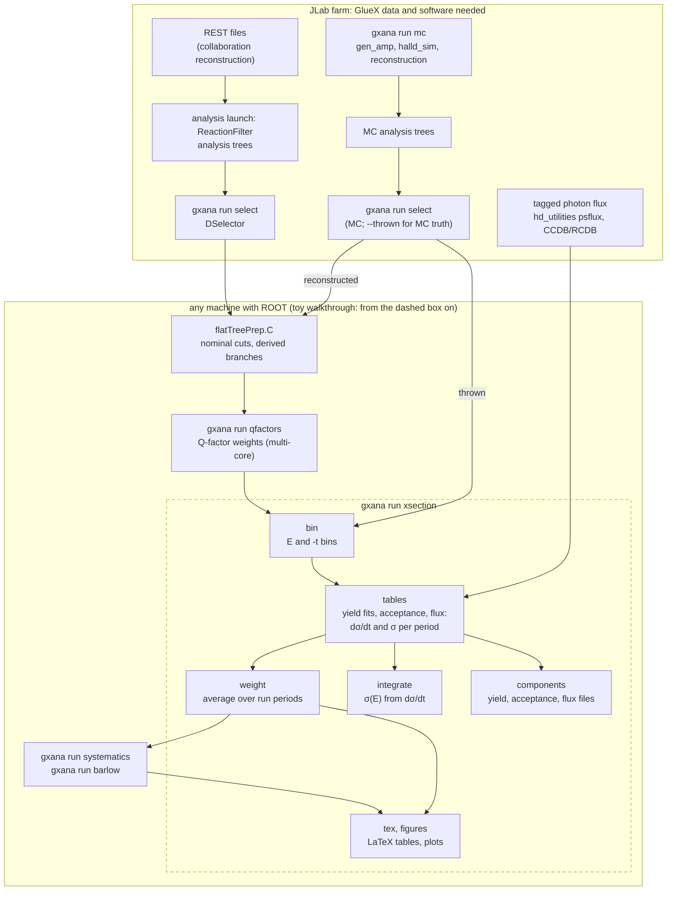

# Getting started

## Who this is for

This guide is for a new graduate student who wants to understand and use this
repository and does not (yet) have access to GlueX data. It explains the
vocabulary, shows how the analysis stages fit together, and walks through a
complete cross-section run on synthetic data that works on a laptop.

The repository holds the analysis code of a PhD measurement of Ξ⁻(1320)
photoproduction, γp → K⁺K⁺Ξ⁻, at the GlueX experiment (Hall D, Jefferson Lab),
packaged as a reusable toolkit: one command-line tool, `gxana`, runs every
analysis stage of a channel from the YAML files in `analyses/<channel>/config/`.

## What runs where

| You want to | Needs | Where |
|---|---|---|
| Learn the cross-section chain on synthetic data ([toy walkthrough](#first-run-the-toy-walkthrough)) | ROOT, a C++ compiler, `uv` | any laptop |
| Plan any stage (`--dry-run`), inspect a channel config (`gxana config show`) | `uv` | any laptop |
| Run the tests (`uv run pytest`); golden tests skip | ROOT, the built apps | any laptop |
| Rerun the thesis cross sections from the preserved data (golden tests, `gxana data stage`) | the author's preserved analysis data (`$GXANA_ANALYSIS_DATA`, [analysis_data.md](analysis_data.md)), which is GlueX collaboration data | any machine holding that data |
| Select events (`gxana run select`), simulate (`gxana run mc`), compute the photon flux | GlueX collaboration membership: analysis trees, the GlueX software stack (`/group/halld`), CCDB/RCDB | JLab ifarm (or a site with the GlueX container) |

GlueX data and simulation are not public. Everything downstream of the flat
trees runs on any machine with ROOT; everything upstream of them needs the
collaboration's data and software.

## Prerequisites

- **uv**, the Python package and project manager:
  [installation](https://docs.astral.sh/uv/getting-started/installation/).
  `uv sync` installs Python dependencies, `pytest` and `cmake` (≥ 3.20, the
  `dev` dependency group) into `.venv`; prefix commands with `uv run`.
- **ROOT ≥ 6.20** with RooFit and RDataFrame ([install](https://root.cern/install/)):
  the minimum `CMakeLists.txt` requires. The thesis ran with ROOT 6.24.04 (GlueX
  version set 5.12.0); the repository is tested with ROOT 6.40.04. `root` and
  `root-config` must be on `PATH`.
- **A C++17 compiler**, the one ROOT was built with (ROOT's CMake configuration
  sets the language standard).
- **git** with submodules: clone with `--recurse-submodules` (the Q-factor
  engine, `packages/qfactors`, is a submodule).
- Optional, for the farm stages: a JLab account with ifarm access, and
  `apptainer` to run the analysis container (`env/apptainer/gxana.def`,
  [environment.md](environment.md)).

Build once, from the repository root:

```bash
git clone --recurse-submodules https://github.com/jahernan1/phd-hadron-physics.git && cd phd-hadron-physics
uv sync
source env/setup.sh
uv run cmake -S . -B build -DCMAKE_PREFIX_PATH="$(root-config --prefix)"
uv run cmake --build build -j
uv run gxana doctor          # [warn] lines name optional tools or data; only [fail] needs action
```

## Glossary

Each entry names the stage or package of this repository that deals with it.

**REST.** The compact reconstructed-event format the GlueX collaboration
writes from raw detector data in its reconstruction launches. This repository
never reads REST files; they are the input of the analysis launches below.

**ReactionFilter, analysis launch, analysis trees.** In an analysis launch the
collaboration runs the ReactionFilter plugin over REST files for a requested
final state (here K⁺K⁺π⁻π⁻p) with a kinematic fit, and writes ROOT *analysis
trees* holding every particle combination ("combo") of each event. A launch
has a version tag (`launch` in `periods.yaml`, e.g. `ana56`) and the reaction's
fit flags (`fit_prefix`). `gxana run select` reads these trees from
`$GXANA_DATA/Trees/`.

**DSelector.** A C++ class (ROOT `TSelector`, from the GlueX
`gluex_root_analysis` library) that loops over analysis trees, applies cuts,
fills histograms and writes a flat tree. Each channel keeps its selectors in
`analyses/<channel>/selectors/`; `gxana run select` compiles and runs them
(GlueX environment only: `source env/setup.sh --gluex`).

**Flat tree.** A plain ROOT tree with one row per combo and simple branches
(beam energy `beam_E`, momentum transfer `t_dist`, invariant masses, weights).
Selection writes raw flat trees; `analyses/<channel>/selection/flatTreePrep.C`
applies the nominal cuts and adds derived branches. Every later stage reads
flat trees, so they are where the toy walkthrough starts.

**−t.** Minus the squared four-momentum transfer from the beam photon to a
produced particle, in GeV²; the kpkpxim selector uses the higher-momentum K⁺,
t = (p<sub>γ</sub> − p<sub>K⁺</sub>)² (branch `t_dist` = −t). −t and the beam
energy E<sub>γ</sub> are the two variables the cross section is binned in
(`binning.yaml`).

**Accidentals, RF beam-bunch subtraction.** The electron beam arrives in
bunches every 4 ns, timed by the accelerator RF. The tagger can record a
photon from a bunch other than the one that made the event (an accidental).
The selector gives combos whose photon is in the right bunch weight 1 and
combos from out-of-time bunches a negative weight (−1/N for N sampled bunches,
times a measured scaling factor), so a weighted sum subtracts the accidental
background. The weight is the flat-tree branch `acc_weight`; the kpkpxim
event weight `hybrid_combo` = `best_combo_rf × acc_weight` combines it with a
combo choice (`best_combo_rf`, set by the selector). Other choices are the accidentals systematic study
(`gxana run systematics`).

**Tagger, tagged photon flux.** The photon tagger measures the energy of each
beam photon. The tagged flux is the number of beam photons per energy bin for
a run period, a `tagged_flux` histogram computed at JLab with the
`hd_utilities` `psflux` tools from the CCDB/RCDB databases
([analyses/kpkpxim/xsection/flux](../analyses/kpkpxim/xsection/flux/README.md)).
No `gxana` stage makes it; `gxana run xsection` reads one file per period from
`xsection.inputs.flux_dir`.

**Q-factor.** An event-by-event probability that an event is signal, from a
signal + background fit of the mass in the event's k nearest neighbours in the
other kinematic variables. It weights away background without mass sidebands.
`gxana run qfactors` runs the QFactors engine (`packages/qfactors`) and writes
the branch named by `physics.qvalue_branch`. In this analysis the cross-section
yields come from the mass fits; the Q-factor yield (`qval_yield` columns)
feeds the Q-value systematic variant (`gxana run systematics`, step `qvalue`).

**Thrown and reconstructed MC.** Simulated signal events: *thrown* are the
generated events (true kinematics, before the detector), *reconstructed* are
the ones that survive detector simulation, reconstruction and the same
selection as the data. `gxana run mc` produces them at JLab (gen_amp,
halld_sim; `packages/montecarlo`); `gxana run select --thrown` writes the
thrown flat trees.

**Acceptance.** The fraction of produced signal events that end up in the
selected sample, per bin: reconstructed MC yield / thrown count. Computed by
the `tables` step of `gxana run xsection` (`accept` column).

**Yield fit.** In each (E<sub>γ</sub>, −t) bin a RooFit fit of the mass
distribution (`physics.observable`) with a signal shape (Johnson in the thesis)
plus a Chebychev-polynomial background; the fitted signal count is the yield.
`gxana_xsec_tables` does it (`packages/xsection`, `YieldFit.h`; lineshape
builders in `packages/fit`), configured by `xsection.fits`.

**Differential and total cross section.** Per bin,
dσ/dt = Y / (n<sub>target</sub> · Φ · BR · A · Δt), with Y the yield,
n<sub>target</sub> the target atoms per barn (`xsection.target`), Φ the
tagged flux in the energy bin, BR the branching ratio of the reconstructed
decay chain (`physics.branching_ratio`), A the acceptance and Δt the −t bin
width; the result is in nb/GeV². The total cross section σ(E<sub>γ</sub>), in
nb, is the same without Δt, from energy-only bins (`tables`), or the sum of
dσ/dt × Δt over the −t bins (`integrate`).

**Run periods.** GlueX Phase-I data taking is split into run periods with
their own beam conditions, launches, flux and MC: 2017-01 (Spring 2017),
2018-01 (Spring 2018) and 2018-08 (Fall 2018) (`periods.yaml`). Each period is
analysed separately; the `weight` step combines them with an error-weighted
average and records the scale factor S = √(χ²/(N−1)) of that average.

**Systematics, Barlow test.** Systematic uncertainties come from repeating the
measurement with other reasonable choices: fit model, accidental subtraction,
run-period combination, track efficiency (`gxana run systematics`,
`packages/systematics`). For cut variations the Barlow test
(`gxana run barlow`, `packages/barlow`) asks whether the change Δ between
the nominal and a varied result exceeds what the change in statistics alone
explains: σ<sub>B</sub> = Δ / √|σ²<sub>nominal</sub> − σ²<sub>varied</sub>|.
A variation with |σ<sub>B</sub>| of order 1 or less is a statistical
fluctuation and adds no systematic.

## The pipeline



The dashed box is what the toy walkthrough runs. The stages and their inputs
and outputs are listed in the [README command reference](../README.md#gxana-command-reference);
the kpkpxim commands in order are in the
[channel pipeline](../analyses/kpkpxim/README.md#pipeline).

## First run: the toy walkthrough

[`examples/toy/`](../examples/toy/README.md) holds a toy channel, γp → toy,
and a generator for its inputs: per run period a flux histogram, data flat
trees with a Gaussian signal peak over a linear background, and signal MC
(reconstructed and thrown). The injected cross section is
dσ/dt = 30 e<sup>−1.5·t</sup> nb/GeV² on 0.1 < −t < 2.4 GeV², so you can
check what comes out. The run takes under a minute.

From the repository root, after the build above:

1. Generate the inputs into a scratch directory outside the checkout and
   point `gxana` at them:

   ```bash
   TOY="${TMPDIR:-/tmp}/gxana-toy"
   rm -rf "$TOY"
   uv run python examples/toy/make_toy.py "$TOY"
   export GXANA_ROOT="$TOY/gxana_root" GXANA_DATA="$TOY/data" GXANA_OUTPUT="$TOY/output"
   ```

   `gxana` finds a channel's config under `$GXANA_ROOT/analyses/<channel>/`;
   `$TOY/gxana_root` links this checkout's `build/`, `packages/` and
   `rootlogon.C`, and `analyses/toy` to `examples/toy/channel`.

2. Read the merged config and the planned commands:

   ```bash
   uv run gxana config show --channel toy
   uv run gxana run xsection --channel toy --dry-run
   ```

3. Run the default steps (`bin`, `tables`, `weight`, `integrate`,
   `components`), then the opt-in `tex` and `figures`:

   ```bash
   uv run gxana run xsection --channel toy
   uv run gxana run xsection --channel toy --steps tex,figures
   ```

4. Compare with the injected truth:

   ```bash
   uv run python examples/toy/check_toy.py
   ```

   Every bin should agree within a few statistical standard deviations. The
   figures are in `$GXANA_OUTPUT/toy/xsection/figures/`, the LaTeX table in
   `$GXANA_OUTPUT/toy/xsection/tables/`, the per-bin fit plots in
   `$GXANA_OUTPUT/toy/xsection/fits/toy/`.

Afterwards open a new shell (the exported `GXANA_ROOT` makes `uv run pytest`
refuse to start). [`examples/toy/README.md`](../examples/toy/README.md) lists
every file each step writes, what the toy leaves out, and changes to try.

## Where to go next

- [README](../README.md): layout, the `gxana` command reference, and the two
  uses of the repository (reproducing the thesis, reusing the framework).
- [docs/RERUN_THESIS.md](RERUN_THESIS.md): rerunning or checking the
  dissertation results, with a map from each figure and table to its command.
- [docs/NEW_CHANNEL.md](NEW_CHANNEL.md): setting up your own reaction channel,
  with a reference of every configuration key.
- Package READMEs: [common](../packages/common/README.md) (the `gxana` CLI,
  config loader, shared C++ helpers), [xsection](../packages/xsection/README.md),
  [systematics](../packages/systematics/README.md),
  [barlow](../packages/barlow/README.md), [fit](../packages/fit/README.md),
  [studies](../packages/studies/README.md),
  [montecarlo](../packages/montecarlo/README.md).
- The thesis channel: [analyses/kpkpxim](../analyses/kpkpxim/README.md).
- [docs/environment.md](environment.md): ifarm, FSU, containers and every
  `GXANA_*` variable.
- [docs/analysis_data.md](analysis_data.md): the preserved data and the golden
  tests, for collaboration members.
- [docs/KNOWN_ISSUES.md](KNOWN_ISSUES.md): where reruns differ from the
  published thesis numbers.
